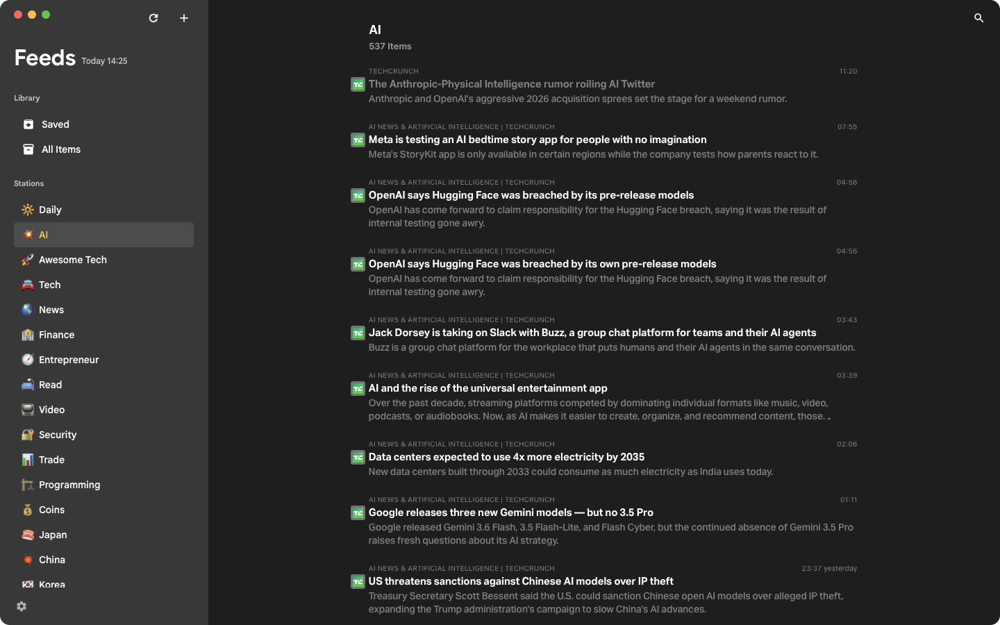
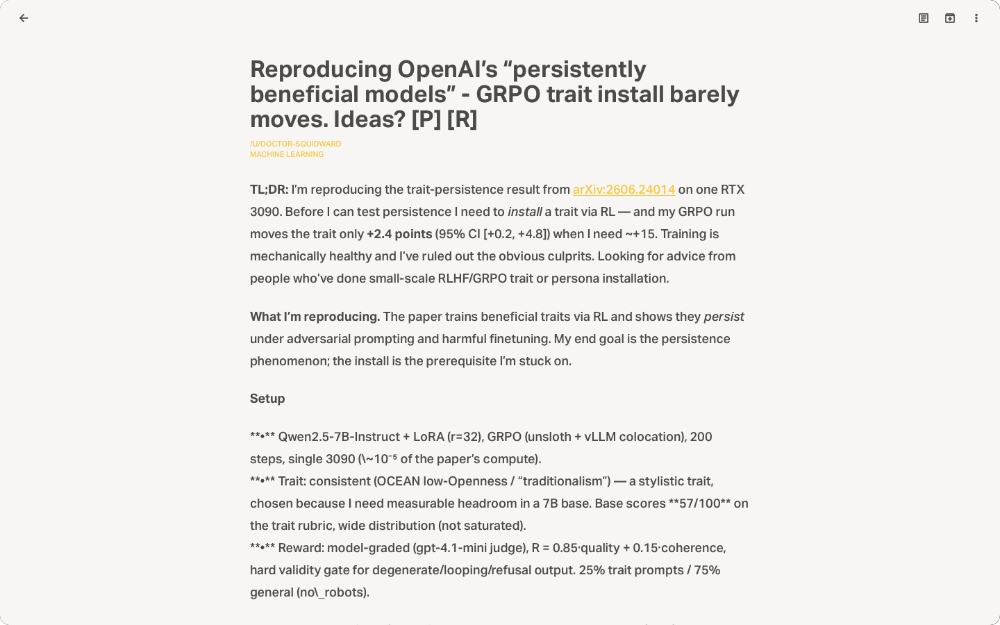

# KiJi

### <ruby>記事<rt>きじ</rt></ruby> · A local, modern RSS reader.

**[kiji.yomilab.app](https://kiji.yomilab.app)** · [Download](https://kiji.yomilab.app/download/)

## Features

- **🏷️ Stations.** Tag feeds into groups
- **📖 Reader mode.** Defuddle + Readability — two engines to parse raw page HTML into article text.
- **📝 Markdown sync.** Sync articles to local folder as markdown.

## Preview

## Privacy

- Local storage
- OPML import/export for portable subscriptions.
- Saved articles sync to your local machine

  📰 KiJi · <a href="https://kiji.yomilab.app">kiji.yomilab.app</a>

